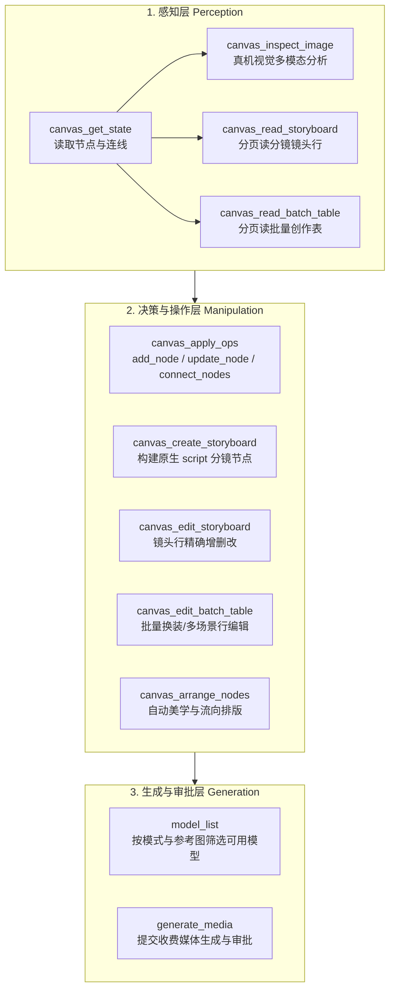

# 智影（media-lab）AI 技能开发与画布适配独立规范
## Media-Lab Canvas Skill Development & Adaptation Specification (v1.0)

> **发布版本**：v1.0.0  
> **适用范围**：`media-lab` 无限画布 Agent、系统内置技能、用户自定义技能包、外部提示词/工作流迁移适配  
> **核心目标**：指导开发者与 AI Agent 将任何通用 Prompt/工作流改造成能在智影无限画布上**高可靠感知、结构化操作节点、合规提交媒体生成并自动排版**的原生商业级技能。

---

## 1. 概述与核心哲学 (Overview & Core Philosophy)

在传统的 AI 聊天应用中，技能（Skill）往往是一段纯文本 Prompt 或一组本地执行脚本（Python / Node.js）。
但在 **智影（media-lab）** 系统中，技能是**画布创作者与智能体之间的协同工法**。Agent 不只是“聊天框里的打字员”，更是**操作无限画布的视听总导演与视觉工程师**。

任何适配或新开发的 `media-lab` 技能，必须恪守以下四大底层原则：

### 1.1 宿主语言优先原则（Host Vocabulary First）
- 技能必须完全采用系统已有的 Agent 工具契约（`canvas_get_state`、`canvas_apply_ops`、`canvas_create_storyboard`、`generate_media` 等）；
- **严禁**在技能中发明第二套工具注册表，严禁引入不存在的伪指令；
- 技能文本是**业务知识与流程指南**，必须符合系统的权限与安全模型。

### 1.2 零服务器负担与零环境污染铁律（Zero Server Overhead & Zero Host Contamination）
- **禁止本地环境调用**：严禁在技能内指示 Agent 运行本地命令（如 `python3 scripts/generate_image.py`、`node ...`、`curl`）；
- **禁止索要凭证与写盘**：严禁索要用户 API Key，严禁要求配置 `.env`，严禁在磁盘上生成临时缓存或中间垃圾文件；
- **全流程系统内闭环**：模型查询、媒体生成、扣费与持久化，100% 走智影系统的统一媒体管线（`model_list` → `generate_media`）与安全网关。

### 1.3 实体化节点落位原则（Canvas Entity First）
- **杜绝纯文本敷衍**：短剧分镜、角色设定、电商批量图表、视觉方案等，绝不能仅在对话框内输出一段 Markdown 代码块就结束；
- **实体落位**：必须通过画布操作在画布上创建对应的真实组件节点（`markdown` 方案节点、`image` 视觉资产卡、`script` 分镜表、`batch-table` 批量创作表、`video` 生成草稿）；
- **关系显式化**：使用 `connect_nodes` 建立源素材与生成目标之间的依赖连线，使创作脉络一目了然。

### 1.4 渐进式加载与上下文预算保护（Progressive Disclosure & Budget Guardrail）
- 系统遵循渐进披露规范：通过 `canvas_list_skills` 发现元数据，按需通过 `skill_read_file` 分页读取；
- 技能正文不应全量堆砌所有子场景细节，应将专项方法论下沉至 `references/` 目录，引导 Agent 按任务按需索取。

---

## 2. 技能包目录结构与元数据契约 (Package Structure & Metadata Contract)

### 2.1 标准目录拓扑

```text
<skill-package-root>/
├── SKILL.md                 # [必选] 技能唯一入口主文件，包含 YAML Frontmatter
├── references/              # [可选] 深入的方法论、词库、场景模板、排查指南
│   ├── general-storyboard.md
│   ├── prompt_templates.md
│   └── troubleshooting.md
└── assets/                  # [可选] 纯只读数据模板、Schema 参照
    └── project-template.json
```

### 2.2 YAML Frontmatter 规范

`SKILL.md` 顶部必须包含标准的 YAML Frontmatter，字段约束如下：

```yaml
---
name: kebab-case-unique-name
description: 精炼且高信息密度的功能概述与触发条件。说明在什么场景下触发、不适用于什么场景，明确输入依赖与产出目标。
---
```

#### 字段硬性指标：
| 字段 | 类型 | 长度约束 | 规范要求 |
| :--- | :--- | :--- | :--- |
| `name` | string | **1 ~ 80 字符** | 必须全小写英文字母、数字、中划线 `-` 或下划线 `_`；严禁包含空格、中文或特殊符号。 |
| `description` | string | **1 ~ 500 字符** | 必须是一段连续、可精确触发的描述。**Agent 依靠此字段决定是否加载该技能**，必须明确写出触发关键词（如“电商PDP”、“短剧分镜”、“Seedance视频”等）和使用边界。 |

---

## 3. 宿主 Agent 原生工具契约全景 (Host Tool Calling Contract)

`media-lab` 为画布 Agent 提供了三层完备的工具能力：



### 3.1 感知层工具（Perception）

1. **`canvas_get_state`**：
   - **用途**：读取当前画布全量节点、连线、任务状态及 `snapshotHash`；
   - **要点**：首次传 `{}`；后续对结构化节点精读时，可在 `nodeIds` 传入节点 ID；所有后续写操作必须携带其返回的最新 `snapshotHash`。
2. **`canvas_inspect_image(nodeId)`**：
   - **用途**：让大模型查看画布上某个图片节点的真实画面像素（非凭空猜测）；
   - **提取要点**：主体形态、材质与反射、精确色感（提取 HEX 颜色）、品牌 Logo 位置、背景空间。
3. **`canvas_read_storyboard(nodeId, offset)`**：
   - **用途**：读取分镜脚本节点的结构化镜头行，返回真实 `rowId` 与当前镜头详情。
4. **`canvas_read_batch_table(nodeId, offset)`**：
   - **用途**：读取批量创作表的任务行、并发数与参考图列（包含可用于提示词的 `@参考图1` 等 mentionToken）。

---

### 3.2 节点操作层工具（Manipulation）

#### 1. `canvas_apply_ops`
通用的画布轻量操作工具，每次最多执行 20 项操作，**不产生费用**。

- **操作类型**：
  - `add_node`：创建新节点。必须提供 `id` 与 `nodeType`（支持：`text`, `markdown`, `image`, `video`, `audio`, `frame`, `batch-table`, `script`），可选传 `title`, `content`, `x`, `y`（省略坐标时服务端自动就近落位，不会叠在原点）。
  - `update_node`：修改节点属性。必须提供 `id` 与 `patch`（可更新标题、Markdown 正文、坐标等）。
  - `connect_nodes`：建立连线。必须提供 `fromNodeId` 与 `toNodeId`，声明生成输入或依赖关系。

#### 2. `canvas_create_storyboard`
专门用于创建具备完整镜头行数据的原生 `script` 节点。**严禁使用普通 Markdown 伪造分镜！**
- **Schema 结构**：
  ```json
  {
    "snapshotHash": "最近读取的快照哈希",
    "nodeId": "自定义新分镜节点ID",
    "title": "EP01 分镜故事板",
    "rows": [
      {
        "shotNumber": 1,
        "durationSeconds": 4,
        "plotDescription": "主角推门而入，眼神骤然冰冷",
        "dialogue": "三年了，我终于回来了。",
        "videoMotionPrompt": "中景，推镜头缓缓向前，主角推开沉重红木门，光线从门缝切入，眼神充满压迫感",
        "imageGenerationPrompt": "ECU 电影特写，男性眼神锐利，侧逆光，冷暖对比，8k",
        "camera": "缓慢推进",
        "motion": "自然动作与呼吸感",
        "shotSize": "中景",
        "lightingAndAtmosphere": "高对比度侧逆光，悬疑冷调",
        "audioEffects": "沉重开门吱呀声，随后心跳重音"
      }
    ]
  }
  ```
- **字段铁律**：`durationSeconds` 为正数数值且必填（>0）；镜头必须有可见动作链与机位描述。

#### 3. `canvas_edit_storyboard`
针对分镜节点单行微调。必须先用 `canvas_read_storyboard` 获取行数据的 `rowId`。
- `action`: `"append"`（追加） \| `"update"`（修改） \| `"remove"`（删除）。

#### 4. `canvas_edit_batch_table`
针对批量创作表组件的高级编辑：
- `action`: `"append"`, `"update"`, `"remove"`, `"set_operation"`, `"set_concurrency"`, `"set_global_prompt"`;
- 行提示词中可使用 `@参考图1`、`@参考图2` 变量指代本行选中的图片。

#### 5. `canvas_arrange_nodes`
批量美学排版工具，只改坐标、不改内容：
- `mode`: `"flow"`（按连线依赖自左向右分层流式排版，**强烈推荐**） \| `"byType"`（按媒体类型分区） \| `"grid"`（网格对齐）；
- 任何多节点新增或连线后，务必调用一次该工具规整画布。

---

### 3.3 媒体生成层工具（Generation）

#### 1. `model_list`
查询当前系统或当前用户可用模型：
- 参数：`mode` (`"image"` \| `"video"` \| `"audio"`)，`referenceNodeIds`（实际引用的画布媒体节点 ID 数组）；
- 服务端会按参考素材格式与数量严格筛选，返回支持的候选模型及其画幅、时长和价格。

#### 2. `generate_media`
发起收费生成任务并接入系统审批流：
- `mode`: `"image"` \| `"video"` \| `"audio"`;
- `nodeId`: 目标画布节点 ID（可续用空闲草稿节点，无草稿时创建新 ID）；
- `title`: 节点展示名（如 `EP01-Shot01-推门入室`）；
- `referenceNodeIds`: 当前画布上绑定的媒体参考节点 ID 列表；
- `prompt`: 完整生成提示词。**引用素材时在提示词中对应位置使用 `@图片1`、`@视频1` 标记**（各类型按在 `referenceNodeIds` 中出现的顺序独立编号）；
- `size`: 模型支持的画幅（如 `"1:1"`, `"9:16"`, `"16:9"`, `"3:4"` 等）；
- `durationSeconds`: 视频/音频时长秒数（需符合模型能力）。

---

## 4. 技能改造与适配“五步法”（The 5-Step Adaptation Formula）

将现有的通用或外部技能适配进 `media-lab` 时，统一执行标准五步改造管线：

```text
┌────────────────┐     ┌────────────────┐     ┌────────────────┐     ┌────────────────┐     ┌────────────────┐
│  Step 1: 脱壳   │ ──> │  Step 2: 锚定   │ ──> │  Step 3: 落位   │ ──> │  Step 4: 接驳   │ ──> │  Step 5: 规整   │
│  清理 CLI 与 .env│     │  画布多模态感知 │     │  创建实体结构节点│     │  原生生成审批管线│     │  画布美学排版   │
└────────────────┘     └────────────────┘     └────────────────┘     └────────────────┘     └────────────────┘
```

### 步骤 1：脱壳去污（Clean & Decouple）
1. 彻底删除所有 `python3 ...`、`node ...` 命令行调用与本地脚本依赖；
2. 彻底删除要求用户配置 `.env`、API Key 或反代 Base URL 的段落；
3. 清理一切第三方营销引流、社交账号、外部网盘等非智影官方的信息；
4. 保证技能所有指令与知识纯正可直接执行。

### 步骤 2：视听感知锚定（Anchor Perception）
1. 将原技能中“请上传本地图片/输入文件路径”改为**“调用 `canvas_get_state` 检索画布已有资产”**；
2. 只要发现参考图片节点，强制指示 Agent 调用 `canvas_inspect_image(nodeId)` 查看真实画面；
3. 要求 Agent 按“主体形态、色彩（HEX）、质感细节、环境光影、Logo版式”五大维度提取视觉事实。

### 步骤 3：实体落位与连线（Materialize Nodes & Edges）
1. **方案层**：指导 Agent 调用 `canvas_apply_ops` 创建 `markdown` 节点输出策划案/大纲/风格锁；
2. **资产层**：为角色、道具、场景分别创建 `image` 视觉资产草稿卡；
3. **分镜层**：**严禁使用纯文本 Markdown 表格敷衍**，必须调用 `canvas_create_storyboard` 创建带真实镜头行（`durationSeconds`、`plotDescription`、`videoMotionPrompt`、`dialogue`）的 `script` 节点；
4. **批量层**：多 SKU/换装任务，调用 `canvas_apply_ops` 创建 `batch-table` 节点；
5. **连线**：调用 `connect_nodes` 将输入节点连向目标生成节点，建立清晰的依赖网络。

### 步骤 4：原生审批接驳（Plug into Generation Pipeline）
1. 当用户明确要求“生图/出视频/生成分镜”时，指示 Agent 先调 `model_list` 匹配可用模型；
2. 调用 `generate_media`，将画布参考图节点填入 `referenceNodeIds`，并在提示词中使用 `@图片1` 等语法锚定；
3. 生成任务自动进入智影审批流，生成结果直接回写画布节点，无本地文件污染。

### 步骤 5：动线美学规整（Layout Governance）
1. 指示 Agent 在完成节点批量创建与连线后，必须调用一次 `canvas_arrange_nodes(mode="flow")`；
2. 让整个生产管线呈现为清晰的横向工作流：
   `【原始需求/剧本文本】 → 【视觉资产与风格卡】 → 【结构化分镜故事板】 → 【最终生成视频】`。

---

## 5. 四大典型业务场景落地规范 (Domain-Specific Blueprints)

### 5.1 电商视觉与批量换装类（E-commerce & PDP & Try-on）
- **核心载体**：`image` 节点矩阵（单品全套） + `batch-table` 节点（多模特批量换装/多场景）。
- **Campaign Style Lock**：必须在 `markdown` 节点中先锁定全套色板 HEX、冷暖调、字体组合与统一留白。
- **画幅红线**：主图严格采用 `"1:1"`；详情页长图严格采用 `"2:3"` 或 `"3:4"` 信息图结构（Infographic）。
- **参数引用**：批量换装必须使用 `canvas_edit_batch_table` 设置 `@参考图1`（模特）与 `@参考图2`（服装）。

### 5.2 影视短剧与漫剧导演类（Short Drama Master Director）
- **核心载体**：`markdown` 剧本节点 + `image` 角色资产卡 + `script` 原生分镜故事板节点。
- **黄金 3 秒钩子**：第 1~2 镜头必须在 3 秒内释放核心冲突或悬念，不拍无关风景空镜。
- **对白估时铁律**：日常语速按 3.8 字/秒计算，公式：
  $$\text{镜头最小时长} = (\text{台词字数} \div 3.8) + 1.2\text{秒 (气口与反应)}$$
- **分镜数据结构**：必须填满 `durationSeconds`、`plotDescription`、`videoMotionPrompt`、`camera`、`motion`。

### 5.3 网文小说改编短剧类（Novel-to-Drama Producer）
- **核心载体**：小说文本节点 → `markdown` 改编大纲与爽点表 → 核心角色资产卡 → `script` 分镜表。
- **内心描写外化法则**：心理活动严禁抽象描写（如“感到愤怒”），必须外化为具体可见的微表情、动作与肢体反馈（如“双拳紧握、指节泛白、眼神冰冷”）。
- **对白精简法则**：砍掉 60% 冗长书面语，转化为具爆发力的口语短金句。

### 5.4 工业级视频提示词编译类（Seedance 2.0/2.5 & Jimeng）
- **核心载体**：`video` 单镜头草稿节点 或 `script` 多镜头分镜节点。
- **单镜头单动作原则**：一个镜头只描述一个核心物理动作链（`起点姿态 → 核心运动/接触 → 终点定格`）。
- **多模态精准锚定**：
  - 首帧锁定：`@图片1 作为镜头起始首帧`；
  - 角色锁定：`@图片2 锁定主角面部特征与发型，微表情自然变化`；
  - 动态分离：主体动作与摄影机运镜分两句话独立描述，避免视角与人物动作打架。

---

## 6. 质量门禁与自测核验清单 (Quality Gates & Verification Checklist)

在任何技能发布、合并或导入前，必须对照本清单逐项验收：

```markdown
### 1. 静态与元数据检查
- [ ] SKILL.md 头部具备合法的 YAML Frontmatter (---包裹)
- [ ] name 为 1~80 字符，符合全小写英文字母/数字/短横线规范
- [ ] description 为 1~500 字符，清晰交代触发场景与能力边界
- [ ] 全文搜索绝无 python3 scripts/、node scripts/、curl 等本地 CLI 指令
- [ ] 全文搜索绝无 .env、IMG_API_KEY、API_KEY 等凭据索要或写盘指引
- [ ] 全文搜索绝无第三方非智影品牌的引流号、外部商业群推广

### 2. 画布运行时契约检查
- [ ] 是否正确指导 Agent 使用 canvas_get_state 获取画布上下文与 snapshotHash
- [ ] 涉及图片素材时，是否明确指导 Agent 使用 canvas_inspect_image 查看真实画面
- [ ] 多镜头任务是否使用 canvas_create_storyboard 创建真实 script 节点（绝不用伪 Markdown）
- [ ] 分镜行是否包含正数 durationSeconds 与专业视听字段
- [ ] 涉及批量生成/换装时，是否规范指导使用 batch-table 节点与 canvas_edit_batch_table
- [ ] 媒体生成是否正确调用 model_list 查询并由 generate_media 提交
- [ ] 提示词中的多模态引用（@图片1、@视频1）是否与 referenceNodeIds 严格对齐
- [ ] 是否在批量创建节点后调用 canvas_arrange_nodes(mode="flow") 进行规整排版

### 3. 部署与性能红线检查
- [ ] 技能内是否不包含任何要求云端服务器做高并发视频重编码/抽帧的指令
- [ ] 节点生成产物完全落位于画布系统存储，源码目录保持 0 临时文件污染
```

---

## 7. 结语

规范是确保智影（media-lab）从单机开发迈向工业化量产与云端商业化部署的基石。遵循本规范开发的技能，不仅能够让 AI Agent 展现出令人惊艳的导演与视觉专业度，更能确保系统始终保持**极低的服务器开销、丝滑的交互体验与坚如磐石的运行时稳定性**。
